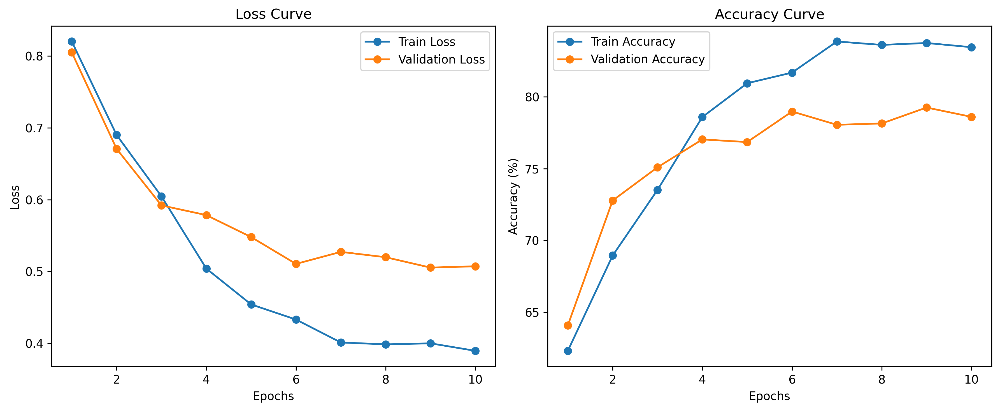
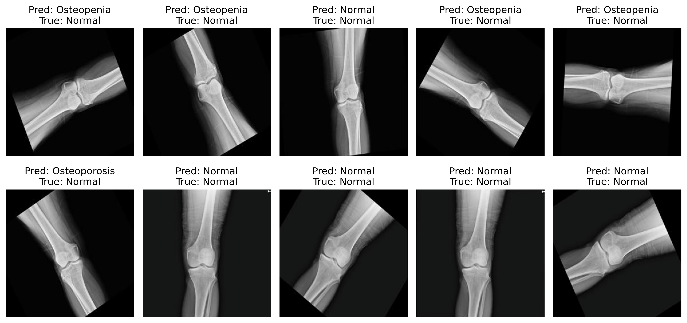
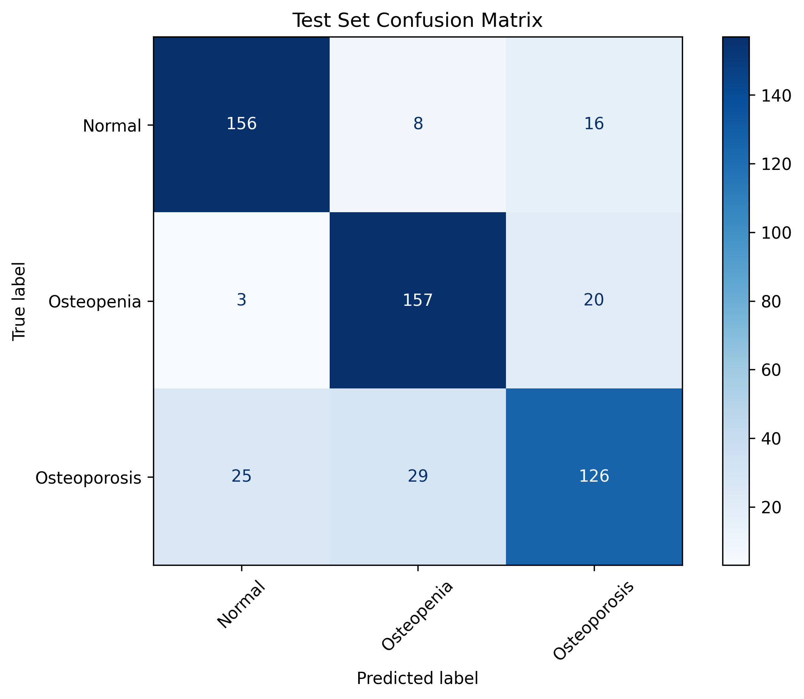

# Knee Osteoarthritis Diagnostic Classifier (EfficientNet-V2)

## System Overview
This repository contains the architecture and training pipeline for a medical diagnostic model designed to classify the severity of Knee Osteoarthritis from radiographic images. Built using PyTorch, the system leverages a fine-tuned `EfficientNet-V2-S` backbone to provide high-accuracy, resource-efficient inference suitable for clinical deployment.

## My Core Engineering Contributions
*   **Clinical Data Imbalance Mitigation:** Engineered a weighted loss function using inverse frequency class weighting (`sklearn.utils.class_weight`) to prevent the model from mirroring the inherent biases of the medical dataset.
*   **Medical-Safe Data Augmentation:** Designed a custom augmentation pipeline tailored for radiological imagery. Replaced destructive standard transforms (like heavy rotation, which skews joint space narrowing) with medical-safe augmentations (horizontal flips and subtle affine translations) to ensure the model learns true physiological markers rather than orientation artifacts.
*   **Pipeline Optimization:** Utilized `StepLR` scheduling and optimized PyTorch `DataLoaders` for efficient batch processing. Separated training logic and metric evaluation into modular components for high reproducibility.

## Tech Stack
*   **Framework:** PyTorch, Torchvision
*   **Architecture:** EfficientNet-V2-S (Transfer Learning)
*   **Data Processing:** Scikit-learn, NumPy, Pandas
*   **Visualization:** Matplotlib
*   **Data Pipeline:** Kagglehub, tqdm

## Model Evaluation & Performance
The model was rigorously evaluated to ensure high recall across minority classes, specifically addressing the overlapping visual features between intermediate osteoarthritis severity levels. 

**Final Metrics:**
*   **Overall Test Accuracy:** 81.67%
*   **Class 0 (Normal):** 71.94%
*   **Class 1 (Osteopenia):** 78.06%
*   **Class 2 (Osteoporosis):** 78.89%

### Learning Curves


### Prediction Samples


### Confusion Matrix


### 🔬 Clinical & Research Highlights

While raw accuracy is a standard metric in machine learning, this pipeline was explicitly engineered with **clinical safety** and **physiological reality** in mind.

* **Prioritizing Patient Safety (Minimizing False Negatives):** In medical diagnostics, the cost of a false negative far outweighs a false positive. Through iterative tuning, this model was optimized to aggressively catch severe Osteoporosis. We intentionally traded a fraction of overall accuracy to drastically reduce the critical risk of missing advanced joint deterioration.
* **Physiologically Sound Augmentations:** The data pipeline strictly avoids destructive spatial transforms (such as heavy random rotations) that artificially distort the horizontal joint space. Instead, it relies on structure-preserving augmentations to ensure the network learns true clinical biomarkers rather than orientation artifacts.
* **Transparent Evaluation & Next Steps:** The included confusion matrices were generated to evaluate ordinal progression errors. The data clearly isolates the model's remaining blind spots, providing a precise roadmap for future research iterations (such as implementing ordinal-weighted loss functions to heavily penalize multi-stage misclassifications).

## How to Run

1. **Install Dependencies:**
   Ensure you have Python 3.8+ installed, then install the required packages:
   ```bash
   pip install torch torchvision scikit-learn matplotlib pandas numpy kagglehub tqdm
